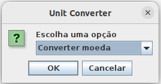
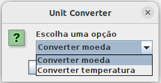
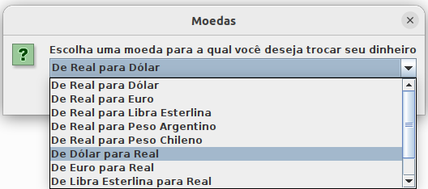
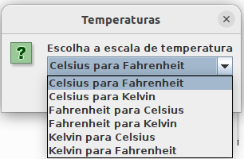

<h1 align="center">
     💱<a href="#" alt="site do unit converter"> Unit Converter </a>
</h1>
<h3 align="center">
    💸 Suas conversões de forma simples 🌡️ 
</h3>

<p align="center">
  
  
  <a href="https://github.com/WellingtonIdeao/unit-converter/commits/main">
    
  </a>
    
</p>

<h4 align="center">
	🚧 Concluído 🚀 🚧
</h4>

Tabela de conteúdos
=====================

   * [Sobre o projeto](#-sobre-o-projeto)
   * [Funcionalidades](#-funcionalidades)
   * [Layout](#-layout)
     * [Desktop](#desktop) 
   * [Como executar o projeto](#-como-executar-o-projeto)
     * [Pré-requisitos](#pré-requisitos)
     * [Compilando e executando o aplicação localmente](#user-content--compilando-e-executando-o-aplicação-localmente)
     * [Executando aplicação via arquivo jar](#user-content--executando-aplicação-via-arquivo-jar)
   * [Tecnologias](#-tecnologias)
   * [Autor](#-autor)
   * [Licença](#-licença)

## 💻 Sobre o projeto

É um aplicativo de desktop para conversão de moedas e temperaturas.

Projeto desenvolvido para o Challenge Backend da Alura Oracle Next Education - ONE.

ONE é um programa de educação e empregabilidade com objetivo social de capacitar pessoas em tecnologia e conectá-las com o mercado de trabalho por meio de empresas parceiras.

---

## ⚙ Funcionalidades

- [x] Os usuários podem converter moedas:
  - [x] de Real para Dólar
  - [x] de Real para Euro
  - [x] de Real para Libras Esterlinas
  - [x] de Real para Peso Argentino
  - [x] de Real para Peso Chileno
  - [x] de Dólar para Real
  - [x] de Euro para Real
  - [x] de Libras Esterlinas para Real
  - [x] de Peso Argentino para Real
  - [x] de Peso Chileno para Real

- [x] Os usúarios podem converter temperaturas:  
  - [x] de Celsius para Fahrenheit
  - [x] de Celsius para Kelvin
  - [x] de Fahrenheit para Celsius
  - [x] de Fahrenheit para Kelvin
  - [x] de Kelvin para Celsius
  - [x] de Kelvin para Fahrenheit
  
---

## 🎨 Layout

### Desktop
<p align="center">
  
  
</p>
<p align="center" style="display: flex; align-items: flex-start; justify-content: center;">
  
  
</p>

---

## 🚀 Como executar o projeto

### Pré-requisitos
Você vai precisa instalar as seguintes ferramentas:
* [Git](https://git-scm.com)
* [JDK 17](https://www.oracle.com/java/technologies/javase/jdk17-archive-downloads.html)
* [Maven](https://maven.apache.org/download.cgi)


#### 🎲 Compilando e executando o aplicação localmente

 ```bash
# Clone este repositório
$ git clone https://github.com/WellingtonIdeao/unit-converter.git

# Acesse a pasta do projeto no terminal/cmd
$ cd unit-converter

# Instale as dependências e compile os arquivos
$ mvn install

# Execute os arquivos compilados(.jar) na JVM (Java Virtual Machine)
$ java -cp target/unit-converter-1.0-SNAPSHOT.jar br.com.ideao.converter.App
```

#### 🧭 Executando aplicação via arquivo jar

```bash
# Acesse a pasta onde está localizado o arquivo .jar no terminal/cmd
$ cd pasta

# Execute o arquivo .jar na JVM (Java Virtual Machine)
$ java -cp unit-converter-1.0-SNAPSHOT.jar br.com.ideao.converter.App
```
---

## 🛠 Tecnologias

As seguintes ferramentas e tecnologias foram usadas na construção do projeto:
* [Git](https://git-scm.com)
* [Visual Studio Code](https://code.visualstudio.com/)
* [Java 17](https://www.oracle.com/java/technologies/javase/jdk17-archive-downloads.html)
* [Java Swing](https://docs.oracle.com/en/java/javase/17/docs/api/java.desktop/javax/swing/package-summary.html)
* [Maven](https://maven.apache.org/download.cgi)
* [Paradigma de programação orientada a objetos](https://pt.wikipedia.org/wiki/Programa%C3%A7%C3%A3o_orientada_a_objetos)

---

## 🦸 Autor

<a><sub><b>Wellington Ideão</b></sub></a> <a href="https://github.com/WellingtonIdeao" title="Github">🚀</a>

Feito por Wellington Ideão 👋🏽 Entre em contato!

[](https://www.linkedin.com/in/wellington-ideao/)
[](mailto:wellington.ideao@gmail.com)

---

## 📝 Licença
Este projeto esta sobe a licença [GPL-3.0](./LICENSE).

